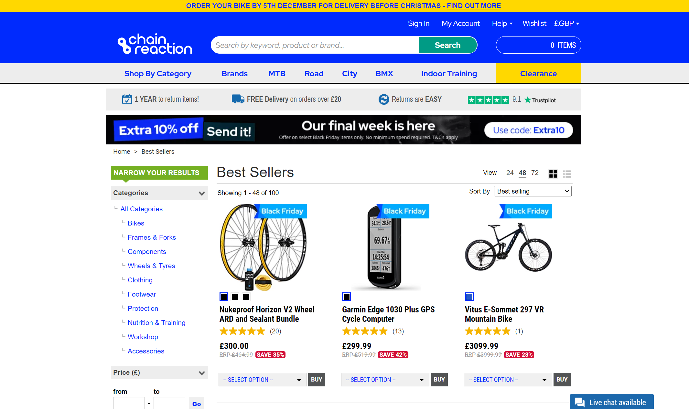
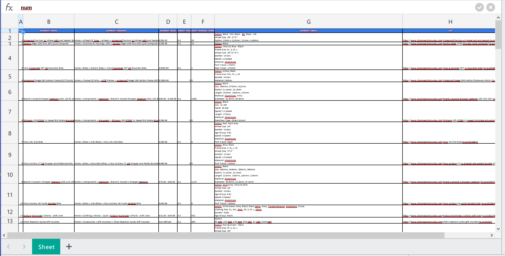

# Chain Reaction Cycle website parser :bicyclist:

___
## Project description

Chain Reaction Cycle website sells sports equipment and outdoor activities products :snowboarder:.

The project is designed to gather specific data of sports products from https://www.chainreactioncycles.com and return it as structured `xlsx` file.
___
## Stack

#### Core project stack:

- [X] Python >=3.7
- [X] selenium==4.6.0 for web scraping
- [X] openpyxl==3.0.10 for operations with MS Excel

Full list of dependencies are in `requirement.txt`.
___

## Installation

First you need to create a virtual environment with the following command:

`python -m venv env`

After activating the virtual environment, use the command below to install the required dependencies:

`pip install -r requirements.txt`

The `requirements.txt` file is located at the project root.
___
## Instructions for usage

The main script is located in `main.py`. 

`scraper_module` repository contains 3 key files:

- `web_scraper.py` - methods of data searching and gathering;
- `data_storage.py` - logic of data storage;
- `params.py` - web driver path essential for script running.
___
## Output
___
### Website

___
### Result data

#### You can find full dataset in `2022-11-29 CR products.xlsx`.